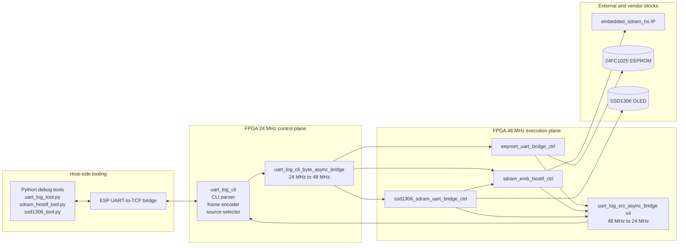
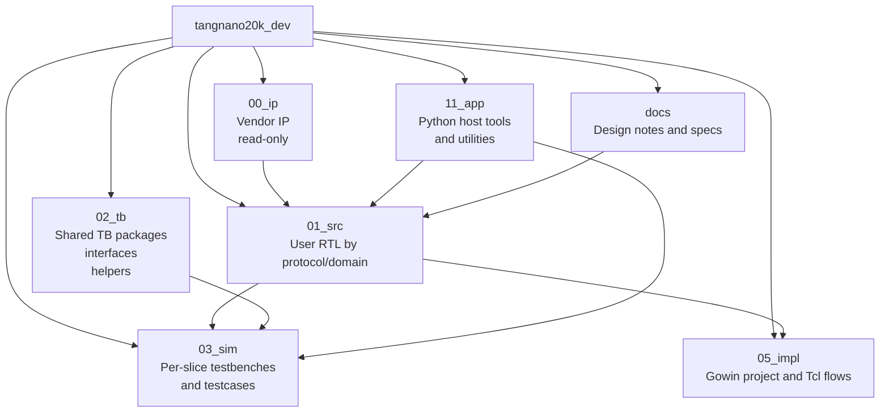

# Project Architecture Blueprint

Generated: 2026-04-27
Repository: tangnano20k_dev
Primary technology: SystemVerilog RTL with Python host utilities
Primary architectural pattern: layered monolithic FPGA design with
protocol-centered subsystems and an event-driven UART control plane

## 1. Purpose and Scope

This document describes the implemented architecture of the repository as it
exists in the current codebase.

It is intended to be the reference for:

- maintaining structural consistency across RTL, testbench, and host tools
- placing new functionality in the correct subsystem
- preserving the existing control-plane and observability model
- extending the design without bypassing established reset, CDC, and logging
  rules

This blueprint covers user RTL, simulation assets, build flow, and host-side
debug tooling.

It does not attempt to reverse-engineer vendor IP internals under `00_ip`.

## 2. Architecture Detection Summary

The repository is not organized as a generic library collection.
It is a board-targeted FPGA system with one production top-level design,
multiple peripheral controllers, and a shared debug/control transport.

The dominant architectural properties are:

- one production board top in `01_src/tangnano20k_top.sv`
- explicit separation between vendor IP and user RTL
- protocol/domain folders for user RTL instead of feature slices by product
- a shared UART event fabric used as the host-facing management plane
- two-clock operation with explicit CDC bridges between 24 MHz and 48 MHz
- unit and integration simulations mirrored under `03_sim`
- Python host tools that speak the same CLI and framed-event protocol as the
  RTL

The result is best described as a hybrid of:

- layered architecture
- protocol-oriented modular decomposition
- event-driven observability and host control
- board-specific monolithic integration at the top level

## 3. Guiding Principles Found in the Codebase

The following design principles are repeatedly enforced by the code structure
and module APIs.

### 3.1 Vendor IP isolation

Vendor and generated artifacts live under `00_ip` and are treated as read-only.
User logic wraps or drives the vendor SDRAM controller through a stable local
command interface.

### 3.2 Protocol ownership by dedicated controllers

Each major peripheral domain owns its own request parsing, protocol sequencing,
completion signaling, and event emission.

Examples:

- `eeprom_uart_bridge_ctrl` owns EEPROM host command handling
- `sdram_emb_hostif_ctrl` owns SDRAM bring-up, self-test, refresh, and host
  arbitration
- `ssd1306_sdram_uart_bridge_ctrl` owns display-side host control and SDRAM
  framebuffer fetch requests

### 3.3 Shared host transport instead of per-peripheral UART stacks

The codebase deliberately centralizes host communication in `uart_log_cli`.
Peripheral blocks do not each implement their own UART framing.
They expose event streams and consume received CLI bytes after the shared UART
core has already handled framing and source selection.

### 3.4 Explicit clock-domain crossings

Cross-domain movement is never implicit.
24 MHz UART/host traffic and 48 MHz execution logic are bridged through named
CDC blocks.

### 3.5 Verification mirrors architecture

Simulation folders track either the production top or a single architectural
slice.
This preserves locality between module behavior and its tests.

## 4. High-Level Architecture

At runtime the design is divided into:

- a 24 MHz control plane for UART receive/transmit, CLI framing, event source
  selection, and UART serialization
- a 48 MHz execution plane for SDRAM control, EEPROM I2C transactions, and
  SSD1306 display operations
- a vendor SDRAM IP block driven by user RTL through the native HS user
  command interface
- a host-side Python toolchain and TCP-to-UART bridge outside the FPGA

The production top integrates all of these into one board image.



## 5. Repository-Level Component Map

The repository layout is part of the architecture, not just storage.



Interpretation:

- `01_src` is the authoritative implementation surface
- `02_tb` provides reusable verification infrastructure
- `03_sim` binds specific DUT slices into testbench tops and scenarios
- `05_impl` is the board implementation and bitstream production surface
- `11_app` is the operator and debug surface for the same RTL protocol

## 6. Core Architectural Components

### 6.1 System integration and board shell

Primary modules:

- `tangnano20k_top.sv`
- `reset_mng.sv`
- vendor PLL and SDRAM IP instances

Responsibilities:

- bind board pins to logical interfaces
- create the 24 MHz and 48 MHz clocks
- generate synchronized resets for both domains
- instantiate the shared UART control plane
- connect peripheral controllers to external pins and SDRAM IP
- define source-slot ownership for host-visible event streams

Internal structure:

- top-level localparams set clock rates, source masks, memory-test bounds,
  and peripheral default addresses
- top-level wires are grouped by domain and by external interface
- all user-visible peripheral controllers are instantiated directly here

Architectural consequence:

The top module is a composition layer.
It should not absorb protocol logic that belongs inside a subsystem.

### 6.2 UART control and observability plane

Primary modules:

- `uart_log_cli.sv`
- `uart_log_evt_if.sv`
- `uart_log_tap.sv`
- `uart_log_cli_evt_fifo.sv`
- `uart_log_src_async_bridge.sv`
- `uart_log_cli_byte_async_bridge.sv`

Purpose:

- provide a single external UART endpoint for all subsystems
- frame outbound events into a fixed transport format
- forward inbound CLI bytes into the execution domain
- select one logical event source at a time
- support system events such as mode changes and soft reset acknowledgements

Interaction pattern:

- producers emit `evt_valid`, `evt_id`, and `arg0..arg2` on
  `uart_log_evt_if`
- each source is first normalized through a local tap/FIFO
- the selected source is moved through a shared event FIFO
- the frame engine serializes a fixed 19-byte UART frame

Important boundary rule:

Peripheral logic must not bypass `uart_log_cli` for host transport if the
feature is intended to be visible to the existing host tools.

### 6.3 SDRAM service domain

Primary modules:

- `sdram_emb_hostif_ctrl.sv`
- `sdram_memtest_ctrl.sv`
- `sdram_status_reg_map.sv`
- `sdram_uart_bridge_ctrl.sv`
- `sdram_uart_access_engine.sv`
- `sdram_uart_bulk_rx.sv`
- `sdram_hs_cmd_pkg.sv`
- `sdram_uart_proto_pkg.sv`

Purpose:

- initialize and gate access to embedded SDRAM HS IP
- execute startup self-test before normal host access
- schedule periodic refresh on the native HS interface
- expose a status-map for software-visible diagnostics
- accept host single-word and bulk-oriented read/write commands
- act as a shared SDRAM service for the display pipeline

Internal structure:

- `sdram_emb_hostif_ctrl` is the arbiter and service owner
- `sdram_memtest_ctrl` is a dedicated bring-up FSM and validation engine
- `sdram_status_reg_map` exposes internal state as indexed words
- `sdram_uart_access_engine` performs one SDRAM access session at a time and
  serializes completion events

Critical architectural rule:

No client gets direct uncontrolled access to the SDRAM native command port.
All production traffic is mediated by `sdram_emb_hostif_ctrl` so refresh,
reset, self-test, and display fetches remain coherent.

### 6.4 EEPROM access domain

Primary modules:

- `eeprom_uart_bridge_ctrl.sv`
- `eeprom_uart_ascii_ctrl.sv`
- `eeprom_i2c_access_engine.sv`
- `eeprom_i2c_byte_ctrl.sv`
- `eeprom_uart_proto_pkg.sv`

Purpose:

- parse host-side EEPROM ASCII commands
- sequence byte-level I2C transactions to the 24FC1025
- support single transfers and staged bulk transfers
- emit progress and completion events through the shared UART event fabric

Pattern used:

- ASCII command parser separated from transaction engine
- bulk ingress handled by the shared raw bulk receiver
- small local event FIFO decouples peripheral activity from host drain rate

### 6.5 SSD1306 display domain

Primary modules:

- `ssd1306_display_ctrl.sv`
- `ssd1306_display_stream_ctrl.sv`
- `ssd1306_uart_bridge_ctrl.sv`
- `ssd1306_sdram_uart_bridge_ctrl.sv`
- `ssd1306_uart_proto_pkg.sv`

Purpose:

- convert high-level display requests into I2C start/write/stop sequences
- support display init, on, off, clear, and full-frame write
- accept host-originated commands and raw frame payloads
- support streaming framebuffer bytes from SDRAM without building a 512-byte
  parallel request bus inside the caller

Architectural distinction:

- `ssd1306_display_ctrl` is request-driven with optional frame latching
- `ssd1306_display_stream_ctrl` is byte-stream driven and requests each byte
  on demand
- the SDRAM-aware bridge is the correct production abstraction because the top
  design stores frame data in SDRAM and must coordinate with the SDRAM service

### 6.6 Shared utility and experimental register components

Primary modules:

- `reset_mng.sv`
- `sync_fifo_ae_af.sv`
- `indexed_reg_pkg.sv`
- `indexed_reg_hub.sv`
- `indexed_reg_test_block.sv`

Purpose:

- provide reusable reset and buffering primitives
- support indirect register-window patterns for future or experimental control
  planes

Current architectural status:

The indexed register blocks are support infrastructure rather than central to
the production top.
They should be treated as reusable internal utilities until a larger control
plane adopts them.

## 7. Architectural Layers and Dependency Rules

The implemented layer model is:

1. board integration layer
2. shared transport and utility layer
3. domain controller layer
4. protocol engine and primitive layer
5. vendor IP and external device boundary

### 7.1 Board integration layer

Contains:

- `tangnano20k_top.sv`
- top-level pin bindings
- clock/reset instantiation

Allowed dependencies:

- may depend on any user RTL subsystem
- may instantiate vendor IP

Forbidden behavior:

- should not implement deep protocol FSMs
- should not duplicate peripheral parsing or transaction logic

### 7.2 Shared transport and utility layer

Contains:

- `uart_log_cli/*`
- `reset_mng.sv`
- common FIFOs and interfaces

Allowed dependencies:

- may be reused by multiple domains
- should not depend on specific board pin assignments

### 7.3 Domain controller layer

Contains:

- SDRAM host interface controller
- EEPROM UART bridge controller
- SSD1306 bridge and display controllers

Allowed dependencies:

- may depend on shared utilities and protocol packages
- may compose lower-level protocol engines

Forbidden behavior:

- should not encode board pin numbers
- should not create ad hoc alternative host transports

### 7.4 Primitive and engine layer

Contains:

- byte-level I2C controller
- UART RX/TX streams
- raw bulk receiver
- dedicated access engines

Expectation:

These blocks should remain narrowly scoped and protocol-specific.
They are the right location for timing-sensitive FSMs and local handshakes.

## 8. Dependency Boundaries and Enforcement Mechanisms

The codebase enforces boundaries through the following techniques.

### 8.1 Packages encode protocol contracts

Examples:

- `sdram_hs_cmd_pkg`
- `sdram_uart_proto_pkg`
- `eeprom_uart_proto_pkg`
- `ssd1306_uart_proto_pkg`
- `uart_log_cli_pkg`

These packages centralize:

- opcode definitions
- event IDs
- payload widths
- fixed protocol constants

### 8.2 Interfaces normalize cross-module event exchange

`uart_log_evt_if` is the architectural seam between event producers and the
shared UART transport.
This reduces repeated point-to-point wiring semantics.

### 8.3 Readiness and done-valid handshakes gate controller composition

Examples:

- `I_REQ_VALID` / `O_REQ_READY`
- `O_DONE_VALID`
- `evt_valid` / `evt_ready`
- command issue and command-ack pairs toward SDRAM HS IP

### 8.4 Explicit CDC blocks enforce clock ownership

There is no hidden sampling across 24 MHz and 48 MHz logic.
CDC responsibilities are assigned to named bridge modules.

## 9. Data Architecture

This repository does not use object-relational data models.
Its data architecture is protocol- and register-oriented.

### 9.1 Primary data forms

- framed UART events with `src_id`, `evt_id`, timestamp, and three 32-bit
  arguments
- ASCII command lines for human-oriented or script-friendly host control
- raw bulk blocks for large payload ingress
- SDRAM status-map words for introspection
- display framebuffer bytes and words
- byte-level I2C sequences

### 9.2 SDRAM data organization

- 32-bit word-oriented native access through the HS controller interface
- self-test and host access share one arbitration owner
- display frame reads are requested by address plus word count
- a status register map exposes internal controller and self-test state

### 9.3 Event payload model

The outbound data model is intentionally flattened.
Instead of sending variable-length structured packets from each subsystem, the
design normalizes results into a fixed event payload format.

Benefits:

- uniform host decoding
- simpler UART framing
- easier shared FIFO design
- consistent logging across peripherals

Constraint:

Large read payloads may require chunking, staging, or raw/bulk side channels.

### 9.4 Display data model

- SSD1306 frame payload size is fixed at 512 bytes for the current 128x32
  implementation
- the stream controller requests bytes lazily
- this preserves architectural flexibility for SDRAM-backed or locally buffered
  frame sources

## 10. Cross-Cutting Concerns

### 10.1 Reset and initialization

Reset is a first-class architectural concern.

Pattern:

- PLL lock and soft reset requests are combined in `reset_mng`
- 24 MHz reset is released directly
- 48 MHz reset release is synchronized in the target domain
- local SDRAM reset hold exists inside `sdram_emb_hostif_ctrl` for manual
  self-test reruns without killing the whole host path

Implication:

Subsystem-local reset behavior is allowed when it preserves operator visibility
and avoids deadening the control plane.

### 10.2 Clock domain crossing

Current production domains:

- 24 MHz UART/control domain
- 48 MHz SDRAM/display/EEPROM execution domain

CDC patterns:

- byte-stream bridge for inbound CLI data
- event-stream bridges for outbound subsystem telemetry

Guideline:

Any new cross-domain path should follow the same dedicated bridge pattern
instead of direct signal peeking across clocks.

### 10.3 Logging and monitoring

Monitoring exists in both RTL and verification.

RTL observability:

- `uart_log_cli` system events
- peripheral-specific event IDs and arguments
- SDRAM status-map register exposure

Testbench observability:

- `tb_log_pkg` with `ERROR`, `WARN`, `INFO`, `DEBUG`, and `TRACE`
- plusarg-configurable verbosity and time formatting

This is a deliberate architecture decision, not only a convenience feature.
The system is meant to be inspectable during simulation and over the deployed
UART path.

### 10.4 Validation and error reporting

Patterns used across subsystems:

- explicit `*_ERR_*` event codes
- request-ready gating instead of implicit dropping where practical
- NACK capture and detailed status words on display I2C operations
- timeout counters on bulk receivers and access engines
- status maps for internal state visibility

### 10.5 Security and authorization

In the FPGA image itself, there is no authentication or authorization layer.
The trust boundary is external:

- the UART physical link
- the ESP TCP bridge
- host tooling and deployment environment

Architectural consequence:

Any security hardening would need to be introduced at the host bridge, an
outer protocol wrapper, or a higher-level command gate.
It is not currently part of the RTL control plane.

### 10.6 Configuration management

Configuration is mostly compile-time and top-level bound.

Examples:

- clock rates
- I2C bit rates
- source enable masks
- default slave addresses
- self-test sizes and wait counts

This gives deterministic synthesis behavior but means runtime configurability
is intentionally limited.

## 11. Service Communication Patterns

### 11.1 Host to FPGA control

Host commands enter over UART and are decoded once.
Subsystems consume shared CLI bytes after source selection and framing are
already handled.

### 11.2 FPGA to host reporting

Subsystems publish events through `uart_log_evt_if`.
The shared transport serializes one selected source at a time.

### 11.3 Inter-subsystem requests

The strongest internal service dependency is:

- SSD1306 display bridge requests framebuffer reads from
  `sdram_emb_hostif_ctrl`

This is a service-style interaction inside one RTL image.
The display block remains the client, and SDRAM host interface remains the
resource owner.

### 11.4 Synchronous versus asynchronous boundaries

- inside one clock domain, communication is synchronous handshake logic
- across 24 MHz and 48 MHz, communication is explicitly asynchronous via
  bridge modules
- between host and FPGA, communication is asynchronous and transport-framed

## 12. Technology-Specific Architectural Patterns

### 12.1 SystemVerilog module organization

The codebase uses small-to-medium modules with clear single-purpose ownership.
Subdirectories represent protocol or device families.

Observed naming patterns:

- `*_ctrl` for controllers and sequencers
- `*_bridge_ctrl` for host-facing protocol adapters
- `*_pkg` for protocol constants and helper functions
- `*_if` for interfaces
- `*_stream` for streaming primitives

### 12.2 FSM-centric implementation style

Controllers are written as explicit FSMs with comments that describe:

- states
- allowed transitions
- error exit rules
- request and completion behavior

This is consistent with the repository-level SystemVerilog guidance.

### 12.3 Python as the operational control plane

Python host tools are not incidental scripts.
They are part of the architecture because they embody the expected operational
model for:

- selecting UART sources
- issuing single and bulk access commands
- decoding response events
- stressing and validating hardware behavior

### 12.4 Build tooling pattern

- simulation uses `03_sim/sim.py` on Windows and `sim_questa_linux.py` on
  Linux
- implementation uses the Gowin project in `05_impl`
- Tcl wrappers such as `run_all.tcl` provide reproducible synthesis and PnR
  entry points

## 13. Representative Implementation Patterns

### 13.1 Event interface pattern

Subsystems present host-visible telemetry through a common interface instead of
ad hoc ports.

```systemverilog
interface uart_log_evt_if #(
  parameter int unsigned EVT_ID_W = 8,
  parameter int unsigned ARG_W    = 32
);
  logic                evt_valid;
  logic [EVT_ID_W-1:0] evt_id;
  logic                evt_ready;
  logic [ARG_W-1:0]    arg0;
  logic [ARG_W-1:0]    arg1;
  logic [ARG_W-1:0]    arg2;
  logic                enable;
endinterface
```

Use this pattern for new event-producing blocks that must integrate with
`uart_log_cli`.

### 13.2 Arbiter-as-owner pattern for shared resources

`sdram_emb_hostif_ctrl` owns the SDRAM command bus and multiplexes among
refresh, self-test, host accesses, and display fetches.

```systemverilog
assign O_SDRC_CMD_EN = !l_sdrc_local_rst_n ? 1'b0 :
                       (l_refresh_cmd_en ? 1'b1 :
                       (l_host_sdrc_selected ? l_host_cmd_en :
                       (l_disp_sdrc_selected ? l_disp_cmd_en :
                        l_test_cmd_en)));
```

When one resource must preserve global invariants, keep one owner and make new
clients request service through that owner.

### 13.3 Streaming byte-fetch pattern

The display streaming controller requests payload bytes lazily.

```systemverilog
assign O_FRAME_BYTE_REQ = (st_state == ST_WAIT_FRAME_BYTE);
assign O_FRAME_BYTE_IDX =
  ((r_active_op == DISP_OP_FRAME_WRITE) &&
   r_txn_phase &&
   (r_step_idx >= 2)) ? FRAME_BYTE_IDX_W'(r_step_idx - 2) : '0;
```

This is the preferred pattern when a full-frame wide bus would be awkward,
costly, or tightly coupled to one data source.

### 13.4 Bulk capture before event serialization

`sdram_uart_access_engine` captures burst read data before emitting UART log
events.
This prevents UART backpressure from perturbing SDRAM-side timing.

That staging pattern should be reused for any new high-rate producer whose sink
is slower or bursty.

## 14. Testing Architecture

The verification strategy mirrors the design hierarchy.

### 14.1 Testbench organization

- `02_tb` contains shared packages, interfaces, and helpers
- `03_sim/01_tangnano20k_top` is the integration test entry point
- higher-numbered folders target specific modules or subsystems

### 14.2 Current slice-oriented verification examples

- embedded SDRAM self-test and host interface
- EEPROM UART and I2C access path
- SSD1306 display controller and UART bridge
- UART log CLI smoke coverage
- top-level integrated smoke test with behavioral SDRAM responder

### 14.3 Verification patterns found in the codebase

- self-checking behavioral responders instead of passive wave-only benches
- shared `tb_log_pkg` for consistent logs and plusarg-driven verbosity
- compact testcase includes under per-slice testbench folders
- unit-like isolation of one controller wherever practical before top-level
  integration smoke

### 14.4 Architectural implication for new work

Every new reusable module should receive its own simulation slice before the
behavior is considered covered by top-level integration.

## 15. Deployment and Runtime Architecture

This repository deploys hardware, not server processes.

### 15.1 Build topology

- source of truth: `01_src`
- vendor IP project inputs: `00_ip`
- synthesis and PnR entry point: `05_impl/tangnano20k.gprj`
- scripted full build: `05_impl/run_all.tcl`

### 15.2 Runtime topology

- FPGA image on Tang Nano 20K
- UART connected to ESP UART-to-TCP bridge
- host tools connect over TCP and operate the FPGA through the shared UART
  protocol

### 15.3 Simulation topology

- ModelSim or Questa launched from `03_sim/sim.py` or `sim_questa_linux.py`
- common sources compiled from `03_sim/vlog.f`
- testbench-specific compile and simulation launched from a selected TB top

## 16. Extension and Evolution Patterns

### 16.1 How to add a new host-visible peripheral

Recommended sequence:

1. create a subsystem directory or place the module under the correct existing
   protocol/domain folder in `01_src`
2. define a `*_proto_pkg.sv` if the feature introduces new host commands,
   event IDs, or fixed constants
3. implement the low-level engine or primitive first
4. implement a `*_bridge_ctrl` if the subsystem is host-operated
5. emit events through `uart_log_evt_if` rather than inventing a new external
   reporting path
6. instantiate the subsystem in `tangnano20k_top.sv`
7. assign it a dedicated `uart_log_cli` source slot if operator-visible source
   selection is required
8. add a simulation folder under `03_sim` for that slice
9. add or update Python host tooling only after the RTL protocol stabilizes

### 16.2 How to add a new SDRAM client

Do not drive the vendor HS interface directly from the new client.

Instead:

- extend `sdram_emb_hostif_ctrl` arbitration inputs and outputs
- define client request-ready and completion signals
- preserve refresh and self-test priority rules
- expose debug/status information through the existing status-map or event path

### 16.3 How to add a new clock-domain interaction

Use one of these patterns:

- byte-stream bridge if the payload is naturally serialized
- event-stream bridge if the payload fits the existing event model
- dedicated FIFO or synchronizer primitive if the data model is different

Do not add direct cross-domain combinational dependency.

### 16.4 How to evolve host protocols safely

- extend packages first
- maintain backward-compatible event IDs when possible
- keep frame formats stable if host tools already depend on them
- update Python tooling and simulation together with RTL changes

## 17. Architectural Decision Records

### ADR-1: Centralize host access in `uart_log_cli`

Decision:

Use one UART core with source selection, fixed framing, and CLI forwarding
instead of per-peripheral UART implementations.

Why:

- reduces duplicate UART logic
- gives one operator workflow
- standardizes event decoding across subsystems

Tradeoff:

- event source multiplexing constrains concurrent visibility
- transport rules must remain stable because many features share them

### ADR-2: Keep SDRAM control behind a user-owned service layer

Decision:

Drive the vendor embedded SDRAM HS IP only through `sdram_emb_hostif_ctrl`
and related helpers.

Why:

- preserves reset, refresh, and self-test invariants
- lets the display subsystem reuse SDRAM safely
- keeps host access observable and diagnosable

Tradeoff:

- new clients must integrate with the arbiter
- direct raw access is intentionally harder

### ADR-3: Use explicit CDC bridges between 24 MHz and 48 MHz

Decision:

Treat control-plane and execution-plane crossings as architecture-level seams.

Why:

- improves timing clarity
- makes ownership of data movement obvious
- limits accidental metastability risk

Tradeoff:

- slightly more modules and wiring
- more explicit latency at boundaries

### ADR-4: Mirror verification per slice under `03_sim`

Decision:

Give major modules and subsystems dedicated simulation folders in addition to
the top-level smoke test.

Why:

- encourages focused debug
- aligns with protocol/domain modularization
- reduces pressure to debug only at the integrated top

Tradeoff:

- higher maintenance burden across many benches
- common TB utilities must stay disciplined and shared

## 18. Architecture Governance

Architectural consistency is currently maintained through:

- directory conventions encoded in `AGENTS.md`
- repeated naming patterns across modules and packages
- top-level ownership of source slots and clock domains
- simulation-folder structure that mirrors implementation slices
- protocol constants centralized in package files
- reproducible simulation and build entry points

The codebase does not appear to use an automated architectural linter.
Consistency is therefore maintained by structure, review discipline, and the
friction created by established integration seams.

## 19. Blueprint for New Development

### 19.1 Standard workflow by feature type

For a new peripheral bridge:

1. define protocol constants in a package
2. implement the low-level sequencer or engine
3. wrap it with a host bridge controller if external control is required
4. connect events to `uart_log_evt_if`
5. connect CLI byte input from the shared control plane if needed
6. add top-level wiring and source-slot integration
7. add a dedicated simulation folder and smoke testcase

For a new internal service client:

1. identify the owning resource arbiter
2. add a request-ready interface instead of direct internal tapping
3. expose status and failure detail in the owner
4. add unit simulation around the owner-client interaction

### 19.2 File placement rules

- reusable RTL goes in `01_src/<subsystem>/`
- common TB utilities go in `02_tb/<subsystem>/` or shared package files
- TB tops and testcase includes go in `03_sim/<nn>_<slice>/`
- host-side operational tools go in `11_app/`
- design explanations and protocol specs go in `docs/`

### 19.3 Common pitfalls to avoid

- adding a second host transport path instead of integrating with
  `uart_log_cli`
- driving SDRAM IP directly from a new client without extending the owner
  controller
- introducing direct 24 MHz to 48 MHz signal crossings without a bridge
- putting protocol constants inline instead of in package files
- relying on top-level smoke coverage without adding a local slice testbench
- bloating the top module with controller internals

### 19.4 Recommended review questions for any new feature

- Which subsystem owns this behavior?
- Which clock domain owns its state?
- Does it need a new event source or just new event IDs in an existing source?
- Should it request service from an existing owner rather than touching a lower
  layer directly?
- Where is the unit-level simulation for the new logic?
- Which host tool or documentation surface must be updated?

## 20. Update Guidance

Update this blueprint when any of the following changes occur:

- a new top-level subsystem is added
- source-slot allocation in `uart_log_cli` changes
- the active clock-domain structure changes
- the SDRAM ownership model changes
- host tooling adopts a materially different protocol model
- simulation folder responsibilities are reorganized

This document should be reviewed together with top-level RTL, protocol package,
and host-tool changes because those surfaces define the effective architecture
of the repository.